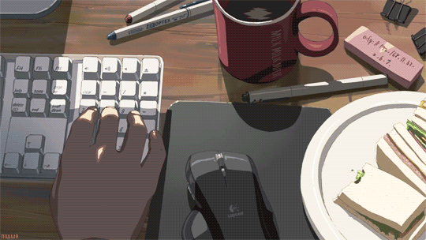

## Hi There 👋

Coding my way through projects 💻  
Fresh graduate full of fire 2025 ✨

>

>
>"I’m passionate about web development and eager to start my career as a Junior Frontend Developer  
>I have dedicated time to learning and refining my skills in frontend development and  
>I continue gaining hands-on frontend experience through new projects"
>
>

---

## 🛠 My Skills

 

  

## 🎧 Now Playing

<table align="center" >
    <td align="center">
       
      
    </td>
     <td align="center">
      
    </td>
</table>
 

## 💌 Support Me

> “💻❤️”

  

